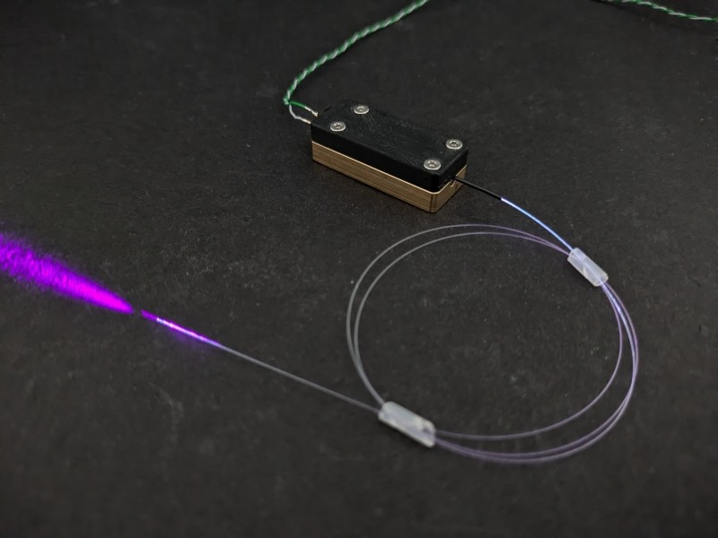
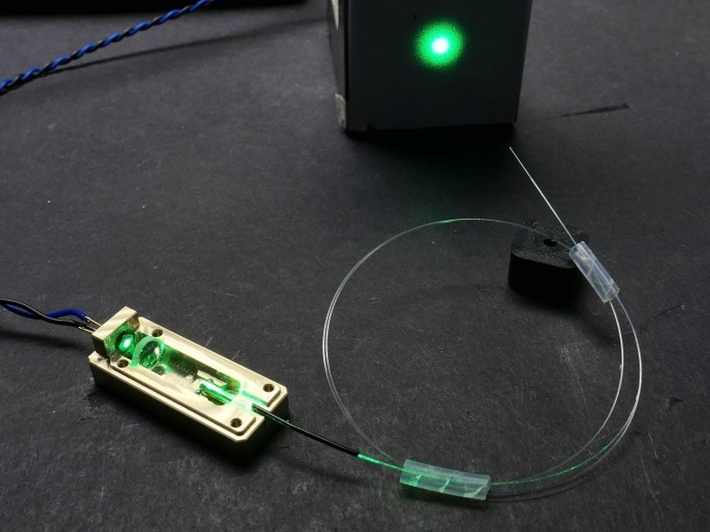
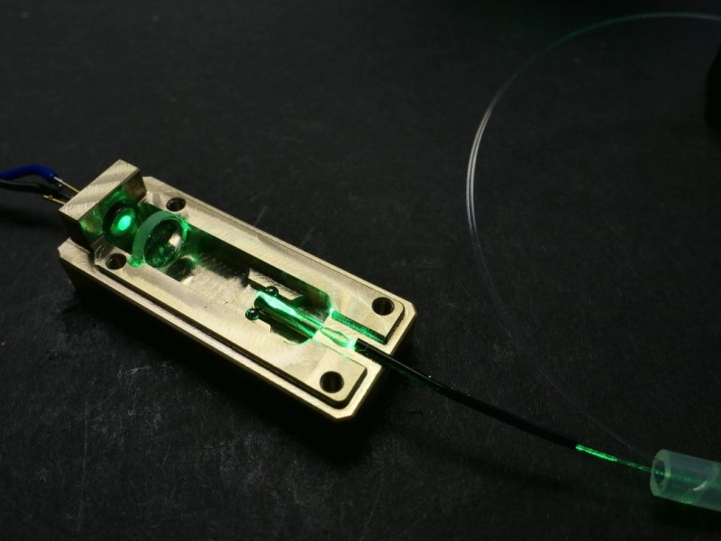
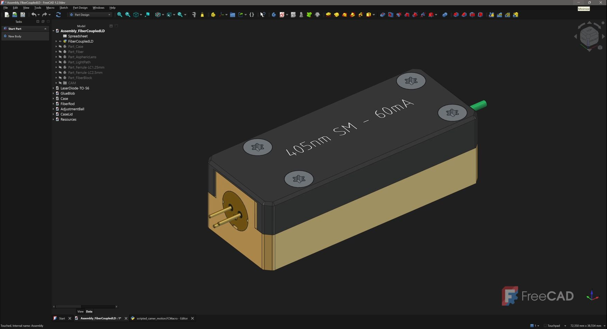

# Fiber Coupled Laser Module

This project provides a compact, customizable fiber-coupled laser diode module platform suitable for the entire visible spectrum. Fiber-coupled light sources are widely used in scientific, industrial, and educational applications, but commercial solutions are often expensive, difficult to customize, or unavailable for specific combinations of laser diodes and optical fibers. In many cases, modules tailored to special wavelengths, uncommon fiber types, or unique experimental requirements simply cannot be sourced off the shelf.

The goal of this project is to provide an open, accessible alternative that can be built using readily available components and a simple machined brass part, while maintaining the precision required for efficient coupling into single-mode and other fibers. The design emphasizes flexibility, reproducibility, and ease of modification, making it suitable both as a practical light source and as a platform for exploring fiber-optic technologies.

### ⚠️ WARNING
Collimated or focussed lasers can cause serious eye injury. Do not replicate without proper training and appropiate laser safety precautions.
 
 
 

    
    
    

### Video

For detailed information on the design, construction process, and underlying principles, take a look at the project's YouTube video:

### Construction

The device was constructed in FreeCAD, feel free to take a look or reuse any components within the project.

    

